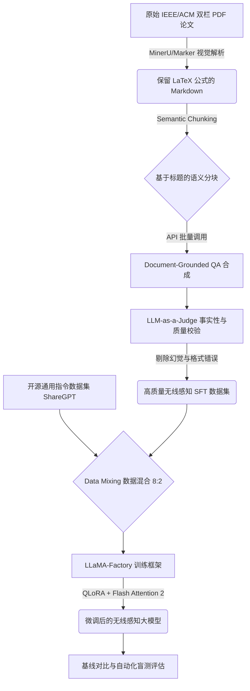

这份计划表将是你接下来一周的**“施工蓝图”**，也是你未来写在简历上、以及在面试中和面试官对线的**“核心剧本”**。

我已经为你将整个项目按照大厂的标准工程落地规范进行了重构。你可以直接将以下内容保存为你的 `README.md` 或项目主文档。

---

# **面向无线感知领域（Wireless Sensing）的 Document-Grounded 数据自动合成与大模型微调引擎**

### **一、 项目背景**
在通用大语言模型（如 Llama-3, Qwen2.5）的预训练语料中，硬核的理工科交叉领域（如无线感知、信号处理、Wi-Fi CSI、FMCW 毫米波雷达）数据占比极低。这导致通用模型在面对该领域专业问题时，极易出现**严重幻觉（Hallucination）**（例如将 CSI 信道状态信息误解释为《犯罪现场调查》）或**逻辑断层**。
同时，该领域缺乏高质量的开源问答数据集，且人工标注成本极高（需要具备相关背景的研究生）。因此，如何从海量非结构化的 PDF 学术论文中，自动化、低成本地提取知识并构建高质量 SFT（监督微调）数据集，成为垂类大模型落地的核心痛点。

### **二、 项目说明**
本项目旨在从 0 到 1 构建一条**“学术论文 $\to$ 高质量 SFT 数据 $\to$ 垂类大模型”**的自动化流水线。
项目不依赖昂贵的人工标注，而是采用 **Data-centric AI** 的思想，通过多模态文档解析技术保留论文中的复杂数学公式（LaTeX），结合 LLM 自动化合成 Document-Grounded（基于文档事实）的问答对，并引入 LLM-as-a-Judge 进行反向校验。最终使用 QLoRA 技术在单张消费级显卡上完成基座模型的微调，显著提升模型在无线感知领域的专业问答与推理能力。

### **三、 核心架构与项目流程**

### **四、 合理的子问题拆解**

1. **非结构化数据解析（Data Parsing）**：如何无损提取双栏 PDF 中的文本，并完美保留信号处理相关的数学公式和矩阵？
2. **高质量知识抽取（Knowledge Extraction）**：如何避免大模型生成废话，强制其基于论文的 Methodology 和 Evaluation 生成有深度的推理题？
3. **数据质量控制（Quality Control）**：如何自动化剔除“看似正确但脱离原论文”的幻觉数据？
4. **灾难性遗忘抑制（Catastrophic Forgetting）**：注入纯领域知识后，如何保证模型依然具备基础的对话和指令遵循能力？
5. **低资源微调工程（PEFT Engineering）**：如何在单卡（如 24G 显存）限制下，高效微调 7B/8B 级别的基座模型并防止 OOM（显存溢出）？

### **五、 迭代版本过程（面试核心对线素材）**

#### **V1.0：基础跑通版（Naive Pipeline）**
*   **实现路径**：使用传统的 `PyPDF2` 提取论文文本 $\to$ 按固定字数（500字）切分 $\to$ 简单 Prompt 生成 QA $\to$ 全量数据直接微调。
*   **遇到的坑点**：
    1. 双栏排版导致文字穿插乱码，所有公式（如 $f_d = \frac{2v}{\lambda}$）全部丢失或变成乱码。
    2. 固定字数切分导致一句话被拦腰截断，模型生成的 QA 前言不搭后语。
    3. 微调后的模型变成了“只会背论文的傻子”，连“你好”都不会回复（灾难性遗忘）。
*   **提升原理与解法**：废弃纯文本解析，引入视觉多模态大模型解析方案；废弃固定切分，改用按 Markdown 标题的语义切分；引入 Data Mixing 策略解决遗忘问题。

#### **V2.0：工程重构版（Document-Grounded & Quality Control）**
*   **实现路径**：引入 `MinerU` 或 `Marker` 进行带格式解析 $\to$ 基于 Markdown Header 进行 Semantic Chunking $\to$ 加入 Document-Grounded 约束的 Prompt $\to$ 引入 LLM-as-a-Judge 打分。
*   **遇到的坑点**：
    1. 生成的问题过于简单（如“本文的作者是谁？”），缺乏深度。
    2. 大模型在生成答案时，依然会“夹带私货”，使用预训练记忆而非原论文内容回答。
*   **提升原理与解法**：在 Prompt 中明确设定角色（如“无线感知顶会审稿人”），强制要求抽取“物理原理、信号流图、公式推导”；Judge 环节增加“反向追溯”逻辑，答案中缺乏公式引用或无法在原文找到依据的直接判定为 0 分并丢弃。

#### **V3.0：工业级微调版（Efficient SFT & Evaluation）**
*   **实现路径**：精洗出 1000 条领域数据 $\to$ 混入 200 条通用高质量指令数据 $\to$ 使用 `LLaMA-Factory` 开启 4-bit QLoRA 微调 $\to$ 采用 GPT-4o/Claude 进行微调前后盲测评估。
*   **遇到的坑点**：
    1. 训练时输入序列过长（Context Length > 4096），导致单卡瞬间 OOM。
    2. 训练 Loss 抖动严重。
*   **提升原理与解法**：工程上开启 Gradient Checkpointing（梯度检查点）与 Flash Attention 2 极致压缩显存；算法上调整 LoRA 秩 $r=16, \alpha=32$，并将学习率降低至 $2e-5$ 配合 Cosine 衰减，确保模型平稳收敛。

### **六、 7 天敏捷开发与执行计划**

#### **Phase 1: 数据引擎构建（Day 1 - Day 3）**
*   **Day 1：数据源准备与无损解析**
    *   筛选 15-20 篇无线感知（Wi-Fi CSI, FMCW Radar）高质量英文 PDF 论文。
    *   部署并运行文档解析工具，获取包含完整 LaTeX 公式和层级标题的 Markdown 文件。
*   **Day 2：基于语义分块的 QA 批量合成**
    *   编写 Python 脚本，基于 `##` 标题对 Markdown 进行语义分块（Semantic Chunking）。
    *   调用大模型 API（如 DeepSeek/Qwen），使用强约束 Prompt 批量生成约 2000 条初始 QA对。
*   **Day 3：LLM-as-a-Judge 清洗与格式化**
    *   编写 Judge 脚本，针对“事实一致性”和“专业深度”进行 1-5 分打分。
    *   剔除 3 分以下及 JSON 格式损坏的数据，保留约 800-1000 条高质量数据。
    *   切分出 50 条作为独立测试集（Test Set）。

#### **Phase 2: 微调引擎构建（Day 4 - Day 5）**
*   **Day 4：环境搭建与基线（Baseline）测试**
    *   在云算力平台（如 AutoDL）租用单张 RTX 3090/4090。
    *   拉取 `LLaMA-Factory`，配置 Python 环境。
    *   加载未微调的基座模型（如 `Qwen2.5-7B-Instruct`），让其回答 50 条测试集，记录回答（作为反面教材/Bad Cases）。
*   **Day 5：数据混合与 QLoRA 训练**
    *   将 800 条领域数据与 200 条开源通用对话数据混合，转换为 Alpaca 格式。
    *   配置训练参数：开启 4-bit 量化，配置 LoRA 适配器，设置学习率与 Epoch（建议 3-5 个 Epoch）。
    *   启动训练，监控 Wandb 上的 Loss 曲线直至收敛，导出 LoRA 权重。

#### **Phase 3: 评估与沉淀（Day 6 - Day 7）**
*   **Day 6：效果对比与盲测打分**
    *   合并基座模型与 LoRA 权重，对 50 条测试集进行重新推理。
    *   编写自动化评估脚本，将微调前后的答案输入给裁判大模型，统计胜率（Win Rate）。
    *   人工挑选 3-5 个极其硬核的对比 Case（例如：微调前写不出多普勒频移公式，微调后能准确推导）。
*   **Day 7：文档撰写与面试准备**
    *   整理项目代码，补充注释。
    *   按照 STAR 法则（情境、任务、行动、结果）将本项目提炼至简历中。
    *   复盘所有遇到的 Bug 和调参经验，准备应对面试官的深挖追问。